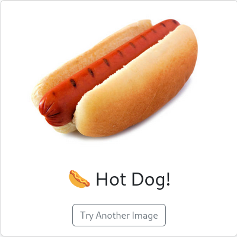

# Hot Dog

This Flask application lets you upload an image and classifies it as “Hot Dog!” or “Not Hot Dog” using a Hugging Face
vision model.

## Screenshots

### Hot Dog detected



### Not Hot Dog detected


## Prerequisites

- Python 3.8 or newer
- `git` (to clone the repository)
- (Optional) CUDA-capable GPU for faster inference

## Installation

1. **Clone the repository**
   ```bash
   git clone https://github.com/your-username/hotdog.git
   cd hotdog
   ```

2. **Create and activate a virtual environment**
   ```bash
   python3 -m venv venv
   source venv/bin/activate
   ```

3. **Install Python dependencies**
   ```bash
   pip install -r requirements.txt
   ```

## Launching the Web App

You can start the app either via Flask’s CLI or by running the script directly.

### Option A: Flask CLI

```bash
export FLASK_APP=app.py
export FLASK_ENV=development
flask run
```

### Option B: Direct launch

```bash
python app.py
```

Once the server is running, open your browser to:

```
http://127.0.0.1:5000
```

## Project Structure

```
hotdog/
├── app.py                  # Flask application
├── requirements.txt        # Python dependencies
├── templates/
│   ├── index.html          # Upload form
│   └── result.html         # Classification result
└── tests/
    ├── images/             # Sample test images
    └── test_classification.py  # Unittest suite
```

## (Optional) Running the Unit Tests

This runs the real Hugging Face pipeline against your sample images:

```bash
python -m unittest discover -v
```
